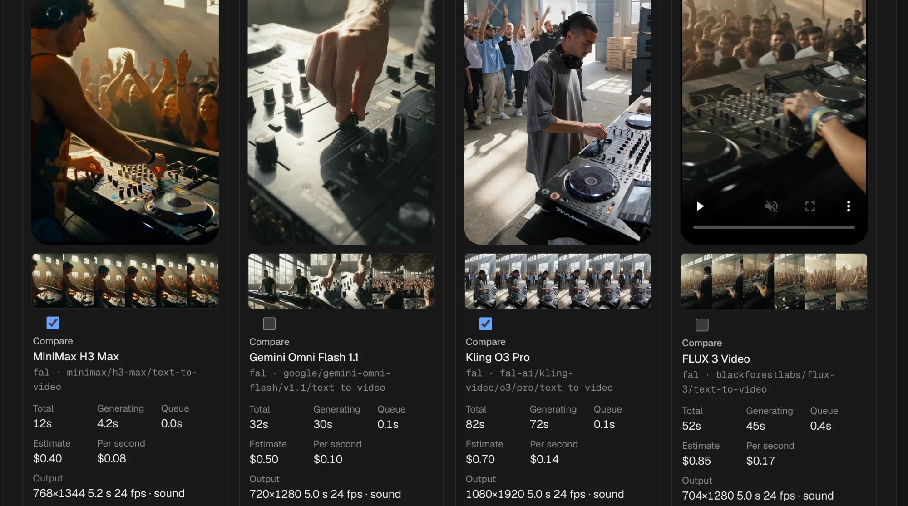
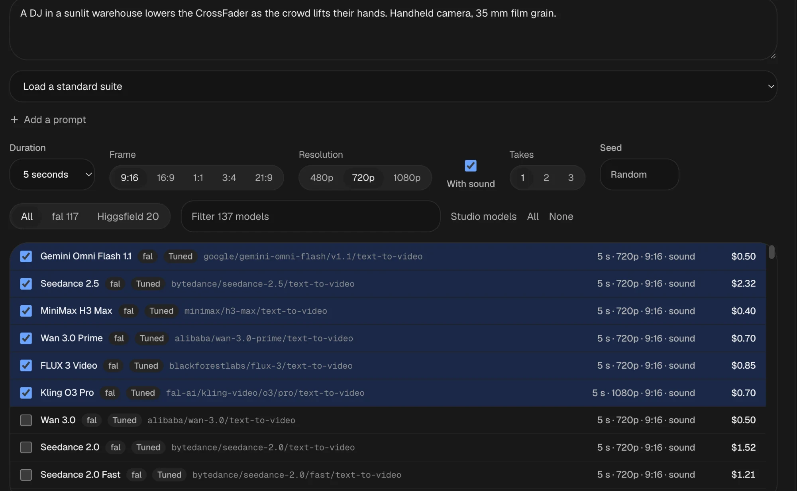

# GenMedia Benchmark

Run one prompt across many fal and Higgsfield video models at once, then compare the results side by side: how they look, how long they took, what they cost, and how they score.

It runs on your machine with your own provider keys. There are no accounts, no hosted service and no database to install.





## What it does

- **Every model, one prompt.** Lists every active text-to-video (or image-to-video) model on fal and Higgsfield. Tuned models use hand-written request builders; every other model is driven from its published parameters, with your settings snapped to what each model accepts.
- **Priced before you spend.** fal models are priced from fal's pricing API (or its historical average), Higgsfield models from Higgsfield's free per-request quote. A daily spend limit stops a run that would go over.
- **Real timing and cost.** Queue time, generation time and, for fal, the billed cost are read back from the provider after each render.
- **Objective checks.** ffmpeg measures motion, hard cuts, freezes, black frames, silence and loudness on every render, plus a six-frame filmstrip.
- **Judging.** Rate and annotate renders, pick a winner, vote blind in the Arena (turned into Elo with confidence intervals), or let an optional AI judge score frames blind.
- **Suites and takes.** Run up to eight prompts in one go, or several takes per model to see how much a model varies. Five standard suites are built in.
- **Leaderboard.** Every model across every benchmark: reliability, median speed, cost per output second, ratings, Elo, judge score and issue rate. Export to CSV, copy any request as cURL.

## Requirements

- Node.js 22.12 or newer
- ffmpeg and ffprobe on your `PATH` (`brew install ffmpeg`, `apt install ffmpeg`, or [ffmpeg.org](https://ffmpeg.org/download.html))
- A [fal](https://fal.ai/dashboard/keys) key, a [Higgsfield](https://cloud.higgsfield.ai/api-keys) key, or both

## Quick start with Claude Code or Codex

Paste this into Claude Code, Codex or another coding agent:

> Set up https://github.com/ZakKrevitt/GenMediaBenchmark and run it

The agent follows [AGENTS.md](AGENTS.md): it installs everything, starts the app and sends you to a setup screen in your browser, where you paste your own keys. Your keys go straight into a local file and never through the chat.

## Setup by hand

```bash
git clone https://github.com/ZakKrevitt/GenMediaBenchmark.git
cd GenMediaBenchmark
npm install
npm run dev
```

Open [http://localhost:3200](http://localhost:3200). The first time, a setup screen checks Node and ffmpeg, then asks for your keys. Each key is checked with its provider for free and saved to `.env.local`.

Prefer the terminal? `npm run setup` walks through the same steps with hidden input, and `npm run setup -- --check` reports what works without printing any key. You can also copy `.env.example` to `.env.local` and fill it in yourself.

One provider is enough; models from a provider without a key are hidden. Change keys or the daily limit later with **Keys and limit** at the top of the page.

### Optional: AI judge

Add an OpenAI key and a model that accepts images in setup (or set `OPENAI_API_KEY` and `LLM_MODEL`) to enable the **AI judge** button. Each judged render reserves `JUDGE_CENTS` (default 5) against the daily limit.

### fal billing

fal only returns billed cost to admin-scoped keys. With an ordinary key, renders keep their estimated price, and timing is still read from fal.

## Your keys stay yours

- Keys live in `.env.local` only (created owner-readable, and gitignored). They are never stored in the database, and the app never sends them back to the browser, not even to the setup screen.
- The server only answers requests made to `localhost` and only accepts changes from its own page, so other websites cannot drive it.
- Everything you generate (database and videos) lives in `.data/`, also gitignored. Delete it to start over.
- `npm run check:secrets` scans the repository for anything that looks like a key. Run it before you push a fork.

## How it works

A Next.js app with an embedded Postgres ([PGlite](https://pglite.dev)) stored in `.data/db`. Each render is recorded before the provider is called, so a repeated click never pays twice. A background loop inside the server polls providers, downloads finished videos, runs the ffmpeg checks and the judge, and reconciles fal's timing and billing.

| Path | What it holds |
| --- | --- |
| `src/services/benchmark.ts` | Model listing, pricing, launching, leaderboard |
| `src/services/renders.ts` | Polling, download, probe, start images |
| `src/services/benchmark-judge.ts` | Optional AI judge |
| `src/lib/fal-schema.ts` | Turns a model's published parameters into a request |
| `src/lib/production-models.ts` | Tuned request builders and prices for well-known models |
| `src/media/video-analysis.ts` | ffmpeg checks |
| `src/components/benchmark.tsx` | The page |

## Tests

```bash
npm test                  # unit tests
npm run test:integration  # end to end with fake fal and Higgsfield, real ffmpeg, no keys or money
npm run check             # tests, typecheck, lint and build
```

## License

MIT, see [LICENSE](LICENSE). The UI building blocks in `src/components/arc` are free components from [Arc](https://uiarc.dev), also MIT, with their notice in [src/components/arc/LICENSE](src/components/arc/LICENSE).
